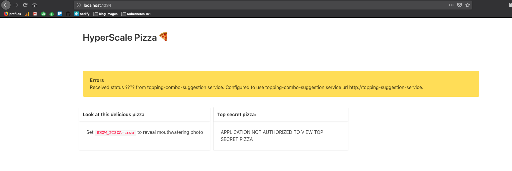
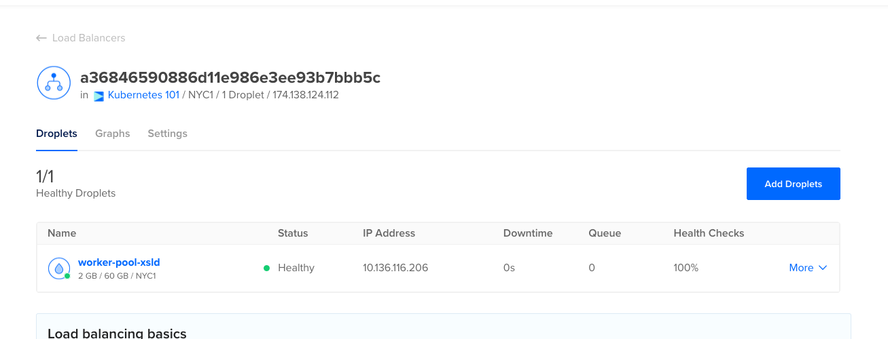
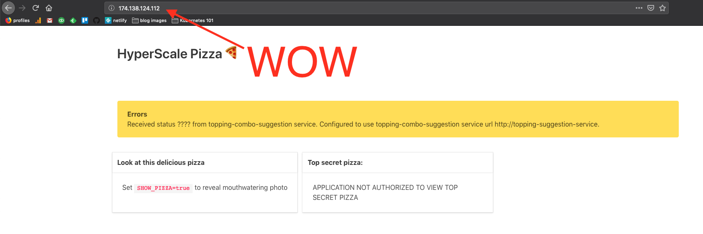

> A Kubernetes Service is an abstraction which defines a logical set of Pods and a policy by which to access them - sometimes called a micro-service. 
>
> — [Kubernetes docs](https://kubernetes.io/docs/concepts/services-networking/service/)

After launching the two different pods into our cluster in the previous module, HyperScale Pizza's platform is nominally running in Kubernetes. Both the webapp pod and the topping combo pod are able to serve web requests on their designated ports. Time for a celebratory slice of pizza! And yet, what we've done so far is essentially useless to end users: first of all, the only way to access either application component is through `kubectl port-forward`, and furthermore, the webapp service can't communicate with the topping suggestion service. That's why we get this error on the homepage:



The next step, then, is to configure our cluster to route network requests with certain URLs to the pods that we want — remember, we're not going to use `kubectl port-forward` in production. Not only do end users need to access webapp pods from the internet, the webapp pods need to talk to the topping suggestion pods in order to deliver value to customers (otherwise how will people learn that anchovy, pineapple, and parsley is their ideal slice?).

### Introducing Kubernetes services

As you might expect to find in a step-by-step tutorial such as this, there is a Kubernetes feature designed to solve this problem. That feature is [services](https://kubernetes.io/docs/concepts/services-networking/service/). Kubernetes services route requests of certain URLs to pods that have certain labels. **Pods are included in a service by virtue of matching its configured labels.** So the following service, for example, would forward in-cluster requests to `my-cool-service` to pods with the label `app`=`my-cool-app`:

```yaml
apiVersion: v1
kind: Service
metadata:
  name: my-cool-service
spec:
  ports:
  - targetPort: 80
  selector:
    app: my-cool-app
```

So if you had this service running in your Kubernetes cluster, alongside that has the label `app=my-cool-app`, you could `curl my-cool-service` and your traffic would go to the `my-cool-app` pod. If you had more than one pod with the `app=my-cool-app` label, requests to `my-cool-service` would be distributed across the pods that have that label.

Kubernetes services work because the Kubernetes cluster runs its own DNS system (DNS is what transforms a url like `https://google.com` into an IP address that can be used to actually communicate with a server). This DNS system maps service names to service `ClusterIP`s, which distribute traffic to the appropriately designated pods (this second part is known as [load balancing](https://en.wikipedia.org/wiki/Load_balancing_(computing)).

The mechanics of how Kubernetes services and Kubernetes DNS work are beyond the scope of this workshop it is _fascinating_ and I encourage you to read Marko Lukša's excellent [Kubernetes in Action](https://www.manning.com/books/kubernetes-in-action) for more detail.

### Creating a service with a `ClusterIP`

For this part, we'll need to have a `hs-pizza-webapp` pod running with uniquely identifiable labels. Let's delete all the pods running in the cluster with `kubectl delete pods --all` and then launch a new copy of the `hs-pizza-webapp` pod by running `kubectl apply -f resources/services/hs-pizza-webapp-pod.yaml`. By the definition we applied, we only have one label on the pod, which isn't that helpful in describing it:

```
$ kubectl get po --show-labels
NAME              READY   STATUS    RESTARTS   AGE   LABELS
hs-pizza-webapp   1/1     Running   0          96s   best_pasta_shape=penne
``` 

Because our service is going to target a label, let's give our running `hs-pizza-webapp` pod a sensible label like `app=hs-pizza-webapp` by running `kubectl label pod hs-pizza-webapp app=hs-pizza-webapp`. If you'd rather update the `resources/services/hs-pizza-webapp-pod.yaml` file and re-run `kubectl apply`, that's fine as well.

Now that our pod is labelled more sensibly, we can configure a service to route traffic to it. The simplest way to expose a service is via `ClusterIP` — in a `ClusterIP` service, calls to `the-service-name` _inside of the Kubernetes cluster_ will resolve to that `ClusterIP`.^[1] The service manifest will look like this:

```yaml
apiVersion: v1
kind: Service
metadata:
  name: webapp
spec:
  type: ClusterIP
  ports:
    - name: default
      port: 80
      targetPort: 1234
      protocol: TCP
  selector:
    app: hs-pizza-webapp
```

Paste this YAML into `k8s/webapp-service.yaml` and run `kubectl apply -f k8s/webapp-service.yaml`. Now, we can run `kubectl describe service webapp` and see if there are any `Endpoints` associated with this service:

```
$ kubectl describe service webapp
Name:              webapp
Namespace:         default
Labels:            <none>
Annotations:       kubectl.kubernetes.io/last-applied-configuration:
                     {"apiVersion":"v1","kind":"Service","metadata":{"annotations":{},"name":"webapp","namespace":"default"},"spec":{"ports":[{"name":"default"...
Selector:          app=hs-pizza-webapp
Type:              ClusterIP
IP:                10.245.96.33
Port:              default  80/TCP
TargetPort:        1234/TCP
Endpoints:         10.244.0.33:1234
Session Affinity:  None
Events:            <none>
```

As we can see here, the `Service` has an `IP` address. We can hit this IP from anywhere in the cluster and it will resolve to a pod that matches the service's `Selector`. We can also see that there is an endpoint registered, which corresponds to the IP address of the pod which matches the `Selector`:

```
$ kubectl describe pod hs-pizza-webapp | grep IP
IP:                 10.244.0.33
# This IP address matches the endpoint in the webapp service above
```

Now, let's test out the different ways of hitting the service. To do this, we're going to launch another pod into the cluster by running `kubectl apply -f resources/utility-pod.yaml`. The utility pod is just something we're using for this workshop; it's not a standard Kubernetes thing.

Get into the utility pod with `kubectl exec -it utility bash` and then hit the `ClusterIP` that you noted above using `curl`: `curl <CLUSTERIP>:80/pizza`. Much more usefully, you can also hit the service by name: `curl webapp/pizza`.

### Adding more pods to the service

A service distributes traffic across all pods that have the appropriate label values. This is useful when you need to scale — or even _HyperScale_ an app! Let's add a another pod to the webapp service by creating a pod template like so:

```yaml
apiVersion: v1
kind: Pod
metadata:
  name: hs-pizza-webapp-2
  labels:
    best_pasta_shape: penne
    app: hs-pizza-webapp
  annotations:
    best_pizza_topping: basil
spec:
  containers:
  - name: hs-pizza-webapp-container
    image: ponderosa/hs-pizza-webapp-service:latest
    imagePullPolicy: Always
    ports:
    - containerPort: 1234
```

You'll note that this is almost exactly the same pod spec as for the first hs-pizza-webapp pod, just with a different pod name and the `app: hs-pizza-webapp` included in the pod definition instead of being applied manually with `kubectl label`. Save this to `k8s/hs-pizza-webapp-pod-2.yaml` and apply it to the cluster with `kubectl apply -f k8s/hs-pizza-webapp-pod-2.yaml`. 

Once the pod is running, shell into the `utility` pod again with `kubectl exec -it utility bash`. Now, we can see that _both pods_ are receiving traffic by running `curl http://webapp/pod_info` a few different times. This endpoint prints out the `HOSTNAME` environment variable of the running pod (each pod's `HOSTNAME` environment variable is set to the name of the pod):

```
$ kubectl exec -it utility bash

root@utility:/app# curl http://webapp/pod_info
Greetings from HOSTNAME hs-pizza-webapp!
Access this pod with kubectl exec -it hs-pizza-webapp
Get logs with kubectl logs hs-pizza-webapp
Get a slice of pizza at /pizza

root@utility:/app# curl http://webapp/pod_info
Greetings from HOSTNAME hs-pizza-webapp-2!
Access this pod with kubectl exec -it hs-pizza-webapp-2
Get logs with kubectl logs hs-pizza-webapp-2
Get a slice of pizza at /pizza
```

So now we have a `webapp` service that is load balancing traffic across two different pods which are running the same container image. This makes adding instances of the running application trivial!

### Creating a `LoadBalancer` service

You'll note that we still cannot access the service we created from _outside_ the cluster. Fortunately, Kubernetes has a first-class way of exposing a service to the wider world: the `LoadBalancer` service. This service will automatically provision a `LoadBalancer` on the underlying cloud provider and rig it up to serve traffic to the Kubernetes service (for more information on what a load balancer is in a cloud computing context, check out [this page about AWS load balancers](https://aws.amazon.com/elasticloadbalancing/)). Note: if you're running on MiniKube, feel free to skip this section, as load-balancing traffic to a VM inside your laptop isn't all that compelling.

To create the `LoadBalancer` service, just add a `type: LoadBalancer` to the service manifest in `k8s/webapp-service.yaml` like so:

```yaml
apiVersion: v1
kind: Service
metadata:
  name: webapp
spec:
  type: LoadBalancer
  ports:
    - name: default
      port: 80
      targetPort: 1234
      protocol: TCP
  selector:
    app: hs-pizza-webapp
```

Then, update your service by running `kubectl apply -f k8s/webapp-service.yaml`. Once you apply it, if you `get` the service with `kubectl`, you'll see that there is a `<pending>` `EXTERNAL-IP`:

```
$ kubectl get svc webapp
NAME     TYPE           CLUSTER-IP     EXTERNAL-IP   PORT(S)        AGE
webapp   LoadBalancer   10.245.96.33   <pending>     80:30380/TCP   35m
```

This is because your cloud provider is actually provisioning a load balancer on your behalf. After a minute or two, visit your cloud provider's dashboard and navigate to the Load Balancer section. You should see one created:



Rerunning `kubectl get svc webapp` after a couple minutes should give you an external IP:

```
$ kubectl get svc webapp
NAME     TYPE           CLUSTER-IP     EXTERNAL-IP       PORT(S)        AGE
webapp   LoadBalancer   10.245.96.33   174.138.124.112   80:30380/TCP   37m
```

Miraculously, if you visit that IP address in your browser, you will see the `webapp` application!



Truly amazing!!!! This humble pizza topping recommendation app is really going places!!!!

## Exercise: create a `ClusterIP` service for the topping suggestion service

Before doing this exercise, create a pod that runs the `ponderosa/topping-suggestion` Docker image by running `kubectl apply -f resources/services/hs-pizza-topping-suggestion-service-pod.yaml`. Once you've done that, your job is to create a service called `topping-suggestion-service` so that the entire app works, instead of showing a big yellow error on the homepage. The steps entailed are as follows:

* Label the running pod with `app=hs-pizza-topping-suggestion`
* Create a manifest for a topping suggestion service named "topping-suggestion-service" in `k8s/topping-suggestion-service.yaml`. It should be a `ClusterIP` service that accepts traffic on port `80` and forwards traffic to port `5678` (remember, the Dockerfile you created for the topping suggestion component specifies that `flask` serve traffic port `5678`). In-cluster requests to the `topping-suggestion-service` host should go to the `topping-suggestion` pod that you just labelled.
* Launch the service into the cluster
* Get the service's `ClusterIP` using `kubectl`
* Shell into the `utility pod` and do the following:
	* Hit the service's `/topping_combo` endpoint via its `ClusterIP`
	* Hit the service's `/topping_combo` endpoint via topping suggestion service name
* Visit the webapp service's root page and make sure that the homepage is actually serving the right thing!

Note, you may need to use `kubectl logs` to debug issues in this exercise.

[^1]: Technically, inside of the [Kubernetes namespace](https://kubernetes.io/docs/concepts/overview/working-with-objects/namespaces/). We're not going to talk about namespaces yet but they're actually pretty important.
[^2]: Cluster IPs stay the same for the life of the service.