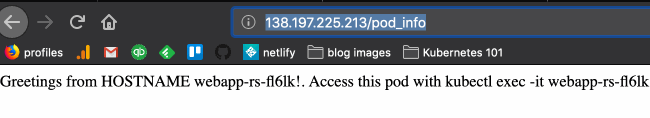

In the [previous module](05-services), we saw how Kubernetes services can help scale web applications: services take a stream of HTTP traffic going to a single location and distribute it to pods that have a certain set of labels.[1] Because this set of pods is an arbitrary size — it could be 1 or 1000 — horizontally scaling is trivial. If you know each pod can handle 300 requests per minute and you're getting 900 requests per minute, you can front 3 identical pods with a service and handle that traffic (assuming, of course, that whatever's running in the pod is the request bottleneck...).
TODO: add diagram

## Scaling HyperScale Pizza with Services and ReplicaSets

Based on current traffic data from HyperScale Pizza's production deployment, it seems likely that we're going to need to have multiple copies of the webapp and topping suggestion pods running behind the webapp and topping suggestion services. Based on initial calculations, we want 2 copies of the webapp and 3 copies of the CPU-intensive topping suggestion service. 

As we did with the webapp service in the previous section, we could create multiple, almost-identical files, `topping-suggestion-pod-[1|2|3].yaml` with their labels configured to join a service, and then manually launch each one with `kubectl apply`. But as we know, the `topping-suggestion` app is prone to random failures (which, by the way, is one of the reasons we're switching to Kubernetes). So in addition to launching `topping-suggestion-pod-[1|2|3]` manually, we'd need to monitor the individual pods to make sure they're up. What a nightmare. Wouldn't it be nice if we could just say "I want three instances of the `topping-suggestion` pod running" and have the cluster handle things for us?  In the words of Homer Simpson, "can't someone else do it?"

."

Enter the replicaSet. 

> A ReplicaSet’s purpose is to maintain a stable set of replica Pods running at any given time. As such, it is often used to guarantee the availability of a specified number of identical Pods.
>
> — [Kube docs](https://kubernetes.io/docs/concepts/workloads/controllers/replicaset/)

A replicaSet keeps a given number of pods running in the cluster at all times. The manifest for a replicaSet looks about like this:

```yaml
apiVersion: apps/v1
kind: ReplicaSet
metadata:
  name: my-cool-app-replicaset
  labels:
    app: my-cool-app
spec:
  replicas: 100
  selector:
    matchLabels:
      app: my-cool-app
  template:
    metadata:
      labels:
        app: my-cool-app
    spec:
      containers:
      - name: my-cool-app-pod
        image: the-docker-image
```

The `spec` refers to the specification for the replicaSet. The `template` key is a `pod` template that's replicated according the the count set in the `replicas` key. As in a service, membership in a replicaSet is determined by labels. The replicaSet has a `matchLabels` field; pods in the cluster that match those labels become managed by the replicaSet. If the replicaSet is created in the cluster, it will create as many pods as is necessary to reach its replica count.

### Creating a replicaSet for the FE pods

Let's start by clearing out the pods from our cluster with `kubectl delete --all pods`. Let's also delete the webapp and topping suggestion services with `kubectl delete service webapp topping-suggestion-service`. Now, let's make a replicaSet that ensures we always have two frontend pods running at all times. We can do this with the following YAML:

```yaml
apiVersion: apps/v1
kind: ReplicaSet
metadata:
  name: webapp-rs
  labels:
    app: hs-pizza-webapp
spec:
  replicas: 2
  selector:
    matchLabels:
      app: hs-pizza-webapp
  template:
    metadata:
      labels:
        app: hs-pizza-webapp
    spec:
      containers:
        - name: webapp-container
          image: ponderosa/hs-pizza-webapp:latest
          ports:
            - containerPort: 1234
          command: ["flask", "run", "-p", "1234", "-h", "0.0.0.0"]
```

Paste this YAML into a new file called `k8s/webapp-replicaset.yaml`. Apply it to the cluster with `kubectl apply -f k8s/webapp-replicaset.yaml`. Check out the replicaSet with `kubectl get rs` and see the pods that it's created with `kubectl get pods`.

```
$ kubectl get pods
NAME              READY   STATUS    RESTARTS   AGE
webapp-rs-n2m8k   1/1     Running   0          5s
webapp-rs-wr9nc   1/1     Running   0          5s
```

You can see that the pod names begin with the name of the replicaSet (`webapp-rs`) and are appended with a random-looking string. These pod names are managed by the replicaSet.

Try deleting one of the pods with `kubectl delete pod your-podname-here` and see what happens!

Let's update the replicaSet to have three replicas and apply the changes to the cluster with `kubectl apply -f k8s/webapp-replicaset.yaml`:

```yaml
apiVersion: apps/v1
kind: ReplicaSet
metadata:
  name: webapp-rs
  labels:
    app: hs-pizza-webapp
spec:
  replicas: 3
...
```

If you run `kubectl get pods`, you should see another copy of the pod running:

```
$ kubectl get pods
NAME              READY   STATUS    RESTARTS   AGE
webapp-rs-fl6lk   1/1     Running   0          8s
webapp-rs-mb757   1/1     Running   0          55s
webapp-rs-wr9nc   1/1     Running   0          106s
```

### Pointing a service at the replicaSet pods

Now, we've got 3 pods running. Let's re-create the webapp service — you should still have the manifest in `k8s/webapp-service.yaml`, but if you don't, feel free to use `resources/webapp-service.yaml`. Even though the EXTERNAL-IP may still be pending, you should see the replicaSet pods showing up as endpoints of the webapp service:

```
$ kubectl describe svc webapp | grep Endpoints
Endpoints:                10.244.0.114:1234,10.244.0.164:1234,10.244.0.27:123
```

You can also check the endpoints registered as part of the webapp service with `kubectl get endpoints`.

If you visit your service's IP in your web browser, you should see different replicaSet pods getting traffic:



## Exercise: creating a replicaSet for the topping suggestion pod

Just like we want our frontend pods managed by a replicaSet, we also want our topping suggestion pods managed by a replicaSet. For this exercise, create a replicaSet called `topping-suggestion-rs` that expects 3 replicas of the pod specified in `resources/hs-pizza-topping-suggestion-service-pod.yaml`. Launch the replicaSet into the cluster using `kubectl apply`.

## Exercise: removing pods from a replicaSet

If you want to have a little fun, try removing a pod from the replicaSet by running `kubectl edit pod your-pod-name-here` and changing the labels so that it no longer meets the criteria of `matchLabels`. Check out how many pods are running in the cluster now using `kubectl get pods`. Now, change the pod you removed from the replicaSet to rejoin it using `kubectl edit` again. How many pods are now running in the cluster?
