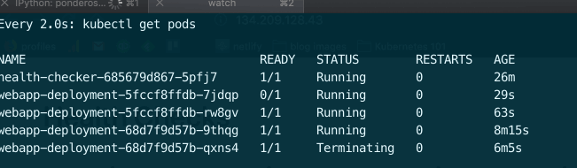
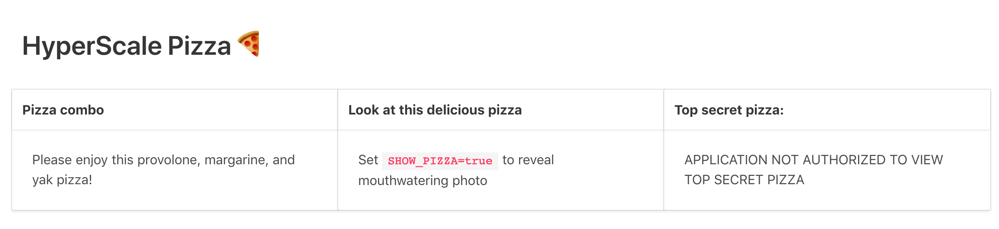

Now that we've got our pods defined, services fronting our pods, and replicaSets making sure that the right number of those pods are actually _running_, we can honestly say that HyperScale Pizza's app can run in Kubernetes. But what would happen if we needed to roll out a new version of the application, or add a label to a pod? Here's how deploying a new version of the application might look:

* Delete the replicaSet(s) we want to replace using `kubectl`
* Update the the replicaSet manifest
* Apply the new replicaSet manifest to the cluster (something like `kubectl apply -f k8s/mycoolreplicaset.yaml`) (the new replicaSet pods will join the appropriate service because they have the right labels).

This would, of course, lead to downtime: between deleting the old ReplicaSet and creating a new one, our services have no pods to direct traffic to. We'd rather create a new replicaSet with the new pod definition, then gradually replace the old replicaSet's pods with the new ones, ideally making sure that _new_ replicaSet pod can handle traffic before committing to the full cutover.

Kubernetes has a first-class way of doing this. The [deployment](https://kubernetes.io/docs/concepts/workloads/controllers/deployment/) is designed to safely roll out a new version of software by managing replicaSets and their constituent pods.

### The deployment

> A *Deployment* controller provides declarative updates for [Pods](https://kubernetes.io/docs/concepts/workloads/pods/pod/) and [ReplicaSets](https://kubernetes.io/docs/concepts/workloads/controllers/replicaset/).
>
> You describe a *desired state* in a Deployment object, and the Deployment controller changes the actual state to the desired state at a controlled rate. You can define Deployments to create new ReplicaSets, or to remove existing Deployments and adopt all their resources with new Deployments.
>
> — [Kubernetes docs](https://kubernetes.io/docs/concepts/workloads/controllers/deployment/)

As with a replicaSet — one of which is created by a deployment under the hood — the deployment is _declarative_. You tell Kubernetes what you want to exist in the cluster, and the cluster makes it happen. Because deployments are declarative, you can be very specific in what you want out of them: Kubernetes gives you lots of switches and knobs to choose from when you're configuring them — you can see a summary [here](https://kubernetes.io/docs/concepts/workloads/controllers/deployment) and an exhaustive list in the [Deployment docs](https://kubernetes.io/docs/reference/generated/kubernetes-api/v1.13/#deploymentspec-v1-apps) (don't forget to look at the [`deploymentStrategy`](https://kubernetes.io/docs/reference/generated/kubernetes-api/v1.13/#deploymentspec-v1-apps) docs as well). You can set the maximum number of new pods to be created at a time, or the maximum number of pods that can be unavailable during the deployment, for example.

Per the [Kubernetes docs](https://kubernetes.io/docs/concepts/workloads/controllers/deployment/#creating-a-deployment), a deployment manifest looks like this:

```yaml
apiVersion: apps/v1
kind: Deployment
metadata:
  name: nginx-deployment
  labels:
    app: nginx
spec:
  replicas: 3
  selector:
    matchLabels:
      app: nginx
  strategy:
    type: RollingUpdate
  template:
    metadata:
      labels:
        app: nginx
    spec:
      containers:
      - name: nginx
        image: nginx:1.7.9
        ports:
        - containerPort: 80

```

## Prework: clearing out the cluster and launching a health checker

Before getting going, let's clear out everything we've created in the cluster so far: `kubectl delete replicaset --all && kubectl delete pod --all && kubectl delete svc webapp topping-suggestion-service`.

To demonstrate the way that deployments function, we're first going to start up a pre-written application that checks the health of our application's two services (the webapp and the topping suggestion service). To launch that, run `kubectl apply -f resources/health-checker-deployment.yaml -f resources/health-checker-service.yaml` from the root of this repository.

Run `kubectl get svc` to see the IP address at which you can reach the health checker service. You will initially see a `<pending>` `EXTERNAL-IP`, something like this:

```
kubectl get svc
NAME             TYPE           CLUSTER-IP       EXTERNAL-IP   PORT(S)        AGE
health-checker   LoadBalancer   10.245.123.128   <pending>     80:30897/TCP   104s
kubernetes       ClusterIP      10.245.0.1       <none>        443/TCP        12m
```

This is totally normal. As we saw in the [services](./05-services) module, the cloud provider that Kubernetes is running on just needs to provision a load balancer and hook it up to the service. Go and grab a cup of coffee and it should be there when you get back (or, if you're as impatient as me, you can run `watch kubectl get svc health-checker` to check every two seconds).

Once you have an external IP available, visit it in the browser and you should see this:


This health checker is hitting the `/health-check` endpoint on both the `topping-suggestion` and `frontend` service. If the pods can return a 200 from those endpoints, they show up as healthy; if not, they show up as unhealthy.

## Creating a deployment

Now that we have a dashboard indicating that our services are unhealthy, let's get one of them running using a deployment. The manifest will look like this.

```
apiVersion: apps/v1
kind: Deployment
metadata:
  name: webapp-deployment
  labels:
    app: hs-pizza-webapp
    workshop: kubernetes-101
spec:
  replicas: 2
  strategy:
    type: Recreate
  selector:
    matchLabels:
      app: hs-pizza-webapp
      workshop: kubernetes-101
  template:
    metadata:
      labels:
        app: hs-pizza-webapp
        workshop: kubernetes-101
    spec:
      containers:
      - name: hs-pizza-webapp-container
        image: ponderosa/hs-pizza-webapp:latest
        imagePullPolicy: Always
        ports:
        - containerPort: 1234
```

Paste this YAML into `k8s/webapp-deployment.yaml` and run `kubectl apply -f k8s/webapp-deployment.yaml`.

Run `kubectl get deployments` to see the `webapp-deployment`:

```
$ kubectl get deployments
NAME                READY   UP-TO-DATE   AVAILABLE   AGE
health-checker      1/1     1            1           12m
webapp-deployment   2/2     2            2           14s
```

If you run `kubectl get pods`, you should see the two webapp replicas running:

```
$ kubectl get pods
NAME                                 READY   STATUS    RESTARTS   AGE
health-checker-685679d867-5pfj7      1/1     Running   0          4m50s
webapp-deployment-7f779d6d9d-hnmf4   1/1     Running   0          45s
webapp-deployment-7f779d6d9d-z46nv   1/1     Running   0          45s
```

The health checker will still be showing the webapp service as unhealthy, because we have not yet created the service (because we haven't created the service, its calls to `http://webapp/health-check` can't resolve to a pod). Let's create the service by running `kubectl apply -f resources/webapp-service.yaml`.

Now, your health checker should show the webapp service as healthy.


## Updating a deployment

Deployment objects persist longer than the replicaSets and pods that they create. If you update a deployment manifest but leave its name the same (e.g. when you've already run `kubectl apply -f mycooldeployment.yaml`, and then you change the `image` tag in the yaml and re-run `kubectl apply -f mycooldeployment.yaml`), then Kubernetes intelligently transitions to the new version of the deployment according to rules laid out in the deployment manifest. In the manifest above, we've selected the "Recreate" strategy, which means Kubernetes will shut down the old replicas and then fire up new ones when you re-deploy it. Let's update the deployment to wait 30 seconds before starting the web server. Paste the following into `k8s/frontend-deployment.yaml`:

```
apiVersion: apps/v1
kind: Deployment
metadata:
  name: webapp-deployment
  labels:
    app: hs-pizza-webapp
    workshop: kubernetes-101
spec:
  replicas: 2
  strategy:
    type: Recreate
  selector:
    matchLabels:
      app: hs-pizza-webapp
      workshop: kubernetes-101
  template:
    metadata:
      labels:
        app: hs-pizza-webapp
        workshop: kubernetes-101
    spec:
      containers:
      - name: hs-pizza-webapp-container
        image: ponderosa/hs-pizza-webapp:latest
        imagePullPolicy: Always
        ports:
        - containerPort: 1234
        command: ["/bin/sh", "-c", "sleep 120 && flask run -p 1234 -h 0.0.0.0"]
```

The `command` field tells the pod that it should run a specific command on startup (instead of the Dockerfile default). If you save `k8s/webapp-deployment.yaml` and run `kubectl apply -f k8s/frontend-deployment.yaml`, you should see the old pods terminate:

```
$ kubectl get pods
NAME                                 READY   STATUS        RESTARTS   AGE
health-checker-685679d867-5pfj7      1/1     Running       0          13m
webapp-deployment-7f779d6d9d-hnmf4   1/1     Terminating   0          9m6s
webapp-deployment-7f779d6d9d-z46nv   1/1     Terminating   0          9m6s
```

Once they're done terminating, you'll see the new pods coming up:

```
$ kubectl get pods
NAME                                 READY   STATUS              RESTARTS   AGE
health-checker-685679d867-5pfj7      1/1     Running             0          13m
webapp-deployment-5676bc6cbb-k975h   0/1     ContainerCreating   0          1s
webapp-deployment-5676bc6cbb-q7k58   0/1     ContainerCreating   0          1s
```

If you flip over to the health check and refresh once these pods are running, you'll see that both apps are unhealthy until after the 60 second sleep. Why? Because Kubernetes _thinks_ the app is up because our `command` is running properly. As long as the process in a pod is not crashing (i.e. exiting with a nonzero status code), Kubernetes thinks things are alright in the pod. So given that web servers need time to boot, how can you do zero-downtime deployments?

## Setting a readiness probe

Kubernetes deployments allow you to specify a _readiness probe_, which the system uses to judge whether or not a container (and, hence, the pod that wraps it) is ready to receive traffic. The readiness probe can take a variety of forms, but we'll use an HTTP endpoint (since we've already got that):

```
apiVersion: apps/v1
kind: Deployment
metadata:
  name: webapp-deployment
  labels:
    app: hs-pizza-webapp
    workshop: kubernetes-101
spec:
  replicas: 2
  strategy:
    type: RollingUpdate
  selector:
    matchLabels:
      app: hs-pizza-webapp
      workshop: kubernetes-101
  template:
    metadata:
      labels:
        app: hs-pizza-webapp
        workshop: kubernetes-101
    spec:
      containers:
      - name: hs-pizza-webapp-container
        image: ponderosa/hs-pizza-webapp:latest
        imagePullPolicy: Always
        ports:
        - containerPort: 1234
        readinessProbe:
          httpGet:
            path: /health-check
            port: 1234
        command: ["/bin/sh", "-c", "sleep 120 && flask run -p 1234 -h 0.0.0.0"]
``` 

The `/health-check` end point, as discussed above, is defined in our application (`webapp/app.py`) and returns a 200 from the webserver. It will not return a 200 until the webserver is capable of serving traffic.

Also note that we have changed the strategy from `Recreate` to `RollingUpdate`. This tells the cluster to spin up the new pods, then substitute them into the deployment — and hence the service which is sending traffic to the deployment — incrementally. This allows for zero-downtime deployments.

Apply the new deployment definition with `kubectl apply -f k8s/frontend-deployment.yaml`.  When you get the pods in the cluster this time, you'll see that Kubernetes is starting the new pods before the old ones are pulled out of service:

```
$ kubectl get pods
NAME                                 READY   STATUS    RESTARTS   AGE
health-checker-685679d867-5pfj7      1/1     Running   0          17m
webapp-deployment-5676bc6cbb-k975h   1/1     Running   0          4m21s
webapp-deployment-5676bc6cbb-q7k58   1/1     Running   0          4m21s
webapp-deployment-68d7f9d57b-9thqg   0/1     Running   0          7s
```

Notice that the new pod has status `Running` but `0/1` pods are `READY`. This is because the `sleep 120` is still running and our web application is not yet up.

Approximately 120 seconds later, when our new pods' sleep command has finished and `flask run` is running, you can see the new pods registering as `READY` and see the old pods with status `Terminating`.

```
$ kubectl get pods

NAME                                 READY   STATUS        RESTARTS   AGE
health-checker-685679d867-5pfj7      1/1     Running       0          19m
webapp-deployment-5676bc6cbb-k975h   1/1     Running       0          6m24s
webapp-deployment-5676bc6cbb-q7k58   1/1     Terminating   0          6m24s
webapp-deployment-68d7f9d57b-9thqg   1/1     Running       0          2m10s
```

If you flip back to the health check in your browser, you'll see that the webapp service is still up, even as we're swapping out the pods that back the service. Pretty cool!!!

Now that our deployment strategy is configured, let's deploy one more time to show that deploys are zero-downtime. Update the `command` field to do a 30 second sleep:

```
apiVersion: apps/v1
kind: Deployment
metadata:
  name: webapp-deployment
  labels:
    app: hs-pizza-webapp
    workshop: kubernetes-101
spec:
  replicas: 2
  strategy:
    type: RollingUpdate
  selector:
    matchLabels:
      app: hs-pizza-webapp
      workshop: kubernetes-101
  template:
    metadata:
      labels:
        app: hs-pizza-webapp
        workshop: kubernetes-101
    spec:
      containers:
      - name: hs-pizza-webapp-container
        image: ponderosa/hs-pizza-webapp:latest
        imagePullPolicy: Always
        ports:
        - containerPort: 1234
        readinessProbe:
          httpGet:
            path: /health-check
            port: 1234
        command: ["/bin/sh", "-c", "sleep 30 && flask run -p 1234 -h 0.0.0.0"]
```

Save this to your deployment manifest file and run `kubectl apply -f k8s/webapp-deployment.yaml`. In your terminal, run `watch kubectl get pods` so you can keep an eye on what's happening in the cluster. Meanwhile, open up your health checker application in your browser and refresh every once in a while. The webapp health check should stay green!

.µ

## There are a lot more settings

Now that you have the basic principles of deployments down, you may want to check out the [official docs](https://kubernetes.io/docs/concepts/workloads/controllers/deployment/). There are a bunch of options you can play around with to get things to work how you want — you can specify the percentage of pods that can be unavailable during a deployment, the maximum number of new pods that can be spun up before they are substituted into the deployment, and more.

## Exercise: create a deployment for the topping suggestion service

Now that you know how to create a deployment and point a service towards the pods it spins up, go ahead and create a deployment that is responsible for the topping suggestion application, along with a `LoadBalancer` service named `topping-suggestion-service` to get traffic to it (feel free to use `resources/topping-suggestion-service.yaml` for this purpose). When you're done, your health checker UI should show both applications as healthy. The Docker image you want to use is `ponderosa/hs-pizza-topping-suggestion:latest`, which, by default, serves traffic on port `5678`. 

When you've successfully created the `topping-suggestion-service`, your application's topping suggestion functionality should be working properly, and look like so:



The middle and right panes are expected to show those error messages — check out the next module for details on getting them to show up!