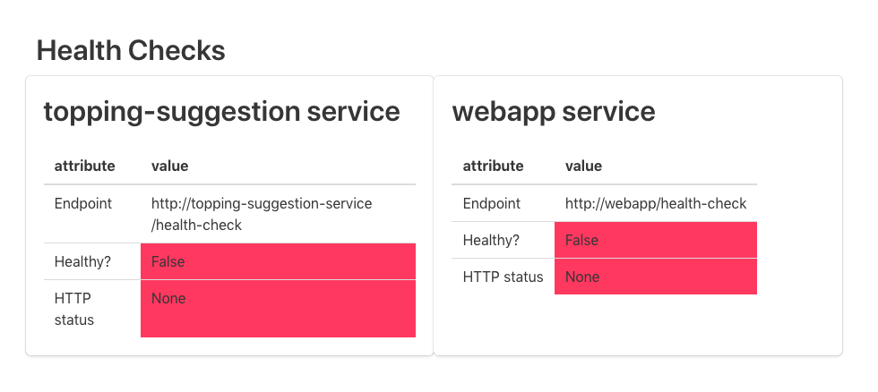
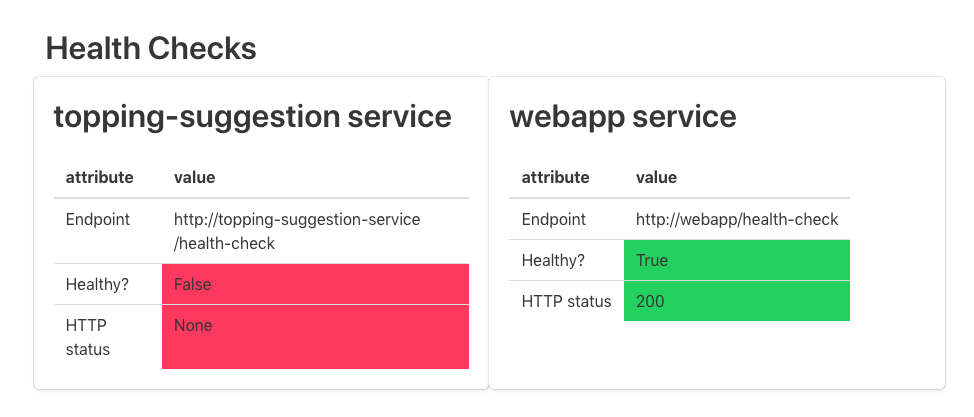
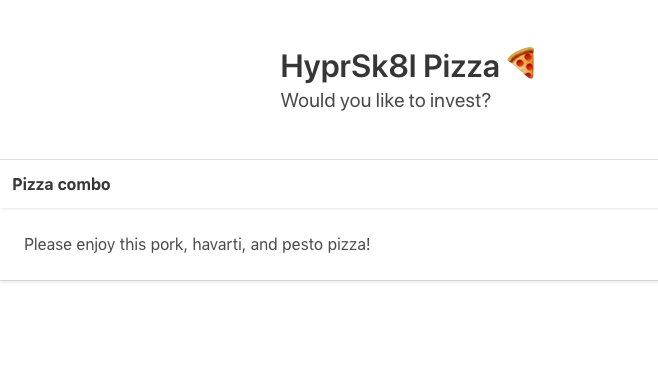

### What's a `Deployment` and why do we have them?

So far, we've moved HyprSk8l Pizza's workloads from the datacenter, which has increased the number of deploy significantly! With the tools we've learned so far, here's how deploying a new version of the application might look:

* Delete the `ReplicaSet` running the application's webserver
* Update the container image specified in the `ReplicaSet` manifest
* Apply the new ReplicaSet manifest to the cluster (something like `kubectl apply -f replica_set.yaml`) — the new `ReplicaSet` pods will join the appropriate service because they have the right labels

Unfortunately, this leads to downtime: between deleting the old ReplicaSet and creating a new one, our services have no pod to direct traffic to. We'd like to roll out new versions without outages, and ideally would like to make sure that _new_ application versions are healthy before committing to the entire deployment.

Fortunately, Kubernetes has a first-class way of rolling out new versions of a software application: the [`deployment`](https://kubernetes.io/docs/concepts/workloads/controllers/deployment/). A deployment manages ReplicaSets and their constituent pods.

> A *Deployment* controller provides declarative updates for [Pods](https://kubernetes.io/docs/concepts/workloads/pods/pod/) and [ReplicaSets](https://kubernetes.io/docs/concepts/workloads/controllers/replicaset/).
>
> You describe a *desired state* in a Deployment object, and the Deployment controller changes the actual state to the desired state at a controlled rate. You can define Deployments to create new ReplicaSets, or to remove existing Deployments and adopt all their resources with new Deployments.
>
> — [Kubernetes docs](https://kubernetes.io/docs/concepts/workloads/controllers/deployment/)

As with a `ReplicaSet` — one of which is created by a `deployment` under the hood — the `deployment` is _declarative_. You tell Kubernetes what you want to exist in the cluster, and the cluster makes it happen.

Deployments give you lots of switches and knobs to choose from when you're configuring them — you can see an summary [here](https://kubernetes.io/docs/concepts/workloads/controllers/deployment) and an exhaustive list in the [`deployment` docs](https://kubernetes.io/docs/reference/generated/kubernetes-api/v1.13/#deploymentspec-v1-apps) (don't forget to look at the [`deploymentStrategy`](https://kubernetes.io/docs/reference/generated/kubernetes-api/v1.13/#deploymentspec-v1-apps); there's two options: `RollingUpdate` and `Recreate`) docs as well. Per the [Kubernetes docs](https://kubernetes.io/docs/concepts/workloads/controllers/deployment/#creating-a-deployment), a deployment manifest looks like this:

```yaml
apiVersion: apps/v1
kind: Deployment
metadata:
  name: nginx-deployment
  labels:
    app: nginx
spec:
  replicas: 3
  selector:
    matchLabels:
      app: nginx
  strategy:
    type: RollingUpdate
  template:
    metadata:
      labels:
        app: nginx
    spec:
      containers:
      - name: nginx
        image: nginx:1.7.9
        ports:
        - containerPort: 80

```

## Prework: clearing out the cluster and launching a helath checker

Before creating a deployment, let's clear out everything we've created in the cluster so far: `kubectl delete pod -l workshop=kubernetes-101 && kubectl delete svc -l workshop=kubernetes-101 && kubectl delete replicaset -l workshop=kubernetes-101`.

To demonstrate the way that deployments function, we're first going to start up an application that checks the health of our application's two services (the frontend and the topping suggestion service). To launch that, run `kubectl apply -f resources/health-checker-deployment.yaml -f resources/health-checker-service.yaml` from the root of this repository.

Run `kubectl get svc` to see the IP address at which you can reach the health checker service. You will initially see a `<pending>` `EXTERNAL-IP`, something like this:

```
kubectl get svc
NAME             TYPE           CLUSTER-IP       EXTERNAL-IP   PORT(S)        AGE
health-checker   LoadBalancer   10.245.123.128   <pending>     80:30897/TCP   104s
kubernetes       ClusterIP      10.245.0.1       <none>        443/TCP        12m
```

This is totally normal. The cloud provider that Kubernetes is running on just needs to provision a load balancer and hook it up to the service. Go and grab a cup of coffee and it should be there when you get back (for the impatient, you can run `watch kubectl get svc health-checker` to check every two seconds).

Once you have an external IP available, visit it in the browser and you should see this:



This health checker is hitting the `/health-check` endpoint on both the `topping-suggestion` and `frontend` service. If the pods can return a 200 from those endpoints, they show up as healthy; if not, they show up as unhealthy.

## Creating a deployment

Now that we have a dashboard indicating that our services are unhealthy, let's get one of them running using a deployment. The manifest will look like this.

```
apiVersion: apps/v1
kind: Deployment
metadata:
  name: frontend-service-deployment
  labels:
    app: hs-pizza-frontend
    workshop: kubernetes-101
spec:
  replicas: 2
  strategy:
    type: Recreate
  selector:
    matchLabels:
      app: hs-pizza-frontend
      workshop: kubernetes-101
  template:
    metadata:
      labels:
        app: hs-pizza-frontend
        workshop: kubernetes-101
    spec:
      containers:
      - name: hs-pizza-frontend-container
        image: ponderosa/hs-pizza-frontend-service:latest
        imagePullPolicy: Always
        ports:
        - containerPort: 1234
```

Paste this YAML into `k8s/frontend-deployment.yaml` and run `kubectl apply -f k8s/frontend-deployment.yaml`.

Run `kubectl get deployments` to see the `frontend-service-deployment`:

```
kubectl get deployments
NAME                          READY   UP-TO-DATE   AVAILABLE   AGE
frontend-service-deployment   2/2     2            2           33s
health-checker                1/1     1            1           26m
```

If you run `kubectl get pods`, you should see the two frontend replicas running:

```
kubectl get pod
NAME                                           READY   STATUS    RESTARTS   AGE
frontend-service-deployment-678fbfbdb7-hpt54   1/1     Running   0          117s
frontend-service-deployment-678fbfbdb7-pkkkr   1/1     Running   0          117s
health-checker-67545c6655-8plgc                1/1     Running   0          27m
```

The health checker will still be showing the frontend service as unhealthy, because we have not yet created the service. Let's do that by running `kubectl apply -f resources/frontend-service.yaml`.

Now, your health checker should show the frontend service as healthy.



## Updating a deployment

Deployment objects persist longer than the ReplicaSets and Pods that they create. If you update a deployment manifest (but leave its name the same), then Kubernetes is smart enough to transition to the new version of the deployment according to rules you lay out in the deployment manifest. In the manifest above, we've selected the "Recreate" strategy, which means Kubernetes will shut down the old version and then fire up new ones. Let's update the deployment to wait 30 seconds before starting the web server. Paste the following into `k8s/frontend-deployment.yaml`:

```
apiVersion: apps/v1
kind: Deployment
metadata:
  name: frontend-service-deployment
  labels:
    app: hs-pizza-frontend
    workshop: kubernetes-101
spec:
  replicas: 2
  strategy:
    type: Recreate
  selector:
    matchLabels:
      app: hs-pizza-frontend
      workshop: kubernetes-101
  template:
    metadata:
      labels:
        app: hs-pizza-frontend
        workshop: kubernetes-101
    spec:
      containers:
      - name: hs-pizza-frontend-container
        image: ponderosa/hs-pizza-frontend-service:latest
        imagePullPolicy: Always
        ports:
        - containerPort: 1234
        command: ["/bin/sh", "-c", "sleep 60 && flask run -p 1234 -h 0.0.0.0"]
```

The `command` field tells the pod that it should run a specific command on startup (instead of the Dockerfile default). If you save `k8s/frontend-deployment.yaml` and run `kubectl apply -f k8s/frontend-deployment.yaml`, you should see the old pods terminate:

```
kubectl get pods
NAME                                          READY   STATUS        RESTARTS   AGE
frontend-service-deployment-fc4fcf79f-mmr96   0/1     Terminating   0          60s
frontend-service-deployment-fc4fcf79f-x2v9d   0/1     Terminating   0          60s
health-checker-67545c6655-8plgc               1/1     Running       0          68m
```

Once they're done, you'll see the new pods coming up:

```
kubectl get pods
NAME                                           READY   STATUS    RESTARTS   AGE
frontend-service-deployment-59b77d47f8-7h8jl   1/1     Running   0          6s
frontend-service-deployment-59b77d47f8-jp55d   1/1     Running   0          6s
health-checker-67545c6655-8plgc                1/1     Running   0          68m
```

If you flip over to the health check and refresh once these pods are running, you'll see that both apps are unhealthy until after the 60 second sleep. Why? Because Kubernetes _thinks_ the app is up because our `command` is running properly. As long as the process in a pod is not crashing, Kubernetes thinks things are alright. So how can you do zero-downtime deployments, then?

## Setting a readiness probe

Kubernetes deployments allow you to specify a _readiness probe_, which the system uses to judge whether or not a container (and, hence, the pod that wraps it) is ready to receive traffic. The readiness probe can take a variety of forms, but we'll use an HTTP endpoint (since we've already got that):

```
apiVersion: apps/v1
kind: Deployment
metadata:
  name: frontend-service-deployment
  labels:
    app: hs-pizza-frontend
    workshop: kubernetes-101
spec:
  replicas: 2
  strategy:
    type: RollingUpdate
  selector:
    matchLabels:
      app: hs-pizza-frontend
      workshop: kubernetes-101
  template:
    metadata:
      labels:
        app: hs-pizza-frontend
        workshop: kubernetes-101
    spec:
      containers:
      - name: hs-pizza-frontend-container
        image: ponderosa/hs-pizza-frontend-service:latest
        imagePullPolicy: Always
        ports:
        - containerPort: 1234
        readinessProbe:
          httpGet:
            path: /health-check
            port: 1234
        command: ["/bin/sh", "-c", "sleep 30 && flask run -p 1234 -h 0.0.0.0"]
``` 

The `/health-check` end point, as discussed above, is defined in our application and returns a 200 from the webserver. It will not return a 200 until the webserver is capable of serving traffic.

Also not that we have changed the strategy from `Recreate` to `RollingUpdate`. This tells the cluster to spin up the new pods, then substitute them into the deployment (and hence the service which is sending traffic to the deployment) incrementally. This allows for zero-downtime deployments.

Apply the new deployment definition with `kubectl apply -f k8s/frontend-deployment.yaml`.  When you get the pods in the cluster this time, you'll see that Kubernetes is starting the new pods before the old ones are pulled out of service:

```
$ kubectl get pods

frontend-service-deployment-59b77d47f8-hbvl4   1/1     Running   0          81s
frontend-service-deployment-59b77d47f8-hp9tq   1/1     Running   0          81s
frontend-service-deployment-654c876879-4pmsw   0/1     Running   0          6s
health-checker-67545c6655-8plgc                1/1     Running   0          93m
```

A few seconds later...

```
$ kubectl get pods

NAME                                           READY   STATUS        RESTARTS   AGE
frontend-service-deployment-59b77d47f8-hbvl4   1/1     Terminating   0          2m6s
frontend-service-deployment-59b77d47f8-hp9tq   1/1     Running       0          2m6s
frontend-service-deployment-654c876879-4pmsw   1/1     Running       0          51s
frontend-service-deployment-654c876879-svq85   0/1     Running       0          11s
health-checker-67545c6655-8plgc                1/1     Running       0          94m
```

Now that things are all configured, let's verify that deployments are zero-downtime. Delete the `command` field from the pod so that it goes back to running the default Docker command:

```
apiVersion: apps/v1
kind: Deployment
metadata:
  name: frontend-service-deployment
  labels:
    app: hs-pizza-frontend
    workshop: kubernetes-101
spec:
  replicas: 2
  strategy:
    type: RollingUpdate
  selector:
    matchLabels:
      app: hs-pizza-frontend
      workshop: kubernetes-101
  template:
    metadata:
      labels:
        app: hs-pizza-frontend
        workshop: kubernetes-101
    spec:
      containers:
      - name: hs-pizza-frontend-container
        image: ponderosa/hs-pizza-frontend-service:latest
        imagePullPolicy: Always
        ports:
        - containerPort: 1234
        readinessProbe:
          httpGet:
            path: /health-check
            port: 1234
```

Save this to your deployment manifest file and run `kubectl apply -f k8s/frontend-deployment.yaml`. Open up your health checker application in your browser and refresh like crazy!

## There are a lot more settings

Now that you have the basic principles of deployments down, you may want to check out the [official docs](https://kubernetes.io/docs/concepts/workloads/controllers/deployment/). There are a bunch of options you can play around with to get things to work how you want — you can specify the percentage of pods that can be unavailable during a deployment, the maximum number of new pods that can be spun up before they are substituted into the deployment, and more.

## Exercise: create a deployment for the topping suggestion service

Now that you know how to create a deployment and point a service towards the pods it spins up, go ahead and create a deployment that is responsible for the topping-suggestion application, along with a service named `topping-suggestion-service` to get traffic to it. When you're done, your health checker UI should show both applications as healthy. The Docker image you want to use is `ponderosa/topping-suggestion-service:0.1`, which serves traffic on port `5678`. 

When you've successfully created the `topping-suggestion-service`, your application should be working properly, and look like so:

