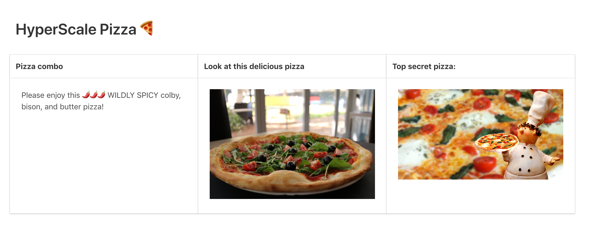

## Setting environment variables in a pod

If you've ever run an application, you've likely used environment variables to configure its behavior. Everything from database connection details to license keys are passed in this way. HyperScale Pizza has an urgent need to set an environment variable in its webapp container, as customers currently CANNOT SEE a photo of delicious pizza on the homepage whose presence is toggled by the environment variable `SHOW_PIZZA=true`. With this crucial business problem in mind, let's look at how to set environment variables in Kubernetes. 

The first key detail is that environment variables are configured on the container level (remember, pods can have multiple containers). This means you'll define them under the `container:` key in your pod manifest. Here's how we'd update the webapp service deployment with the crucial `SHOW_PIZZA=true` environment variable:

```
apiVersion: apps/v1
kind: Deployment
metadata:
  name: webapp-deployment
  labels:
    app: hs-pizza-webapp
    workshop: kubernetes-101
spec:
  replicas: 2
  strategy:
    type: RollingUpdate
  selector:
    matchLabels:
      app: hs-pizza-webapp
      workshop: kubernetes-101
  template:
    metadata:
      labels:
        app: hs-pizza-webapp
        workshop: kubernetes-101
    spec:
      containers:
      - name: hs-pizza-webapp-container
        image: ponderosa/hs-pizza-webapp:latest
        imagePullPolicy: Always
        ports:
        - containerPort: 1234
        readinessProbe:
          httpGet:
            path: /health-check
            port: 1234
        env:
          - name: SHOW_PIZZA
            value: "true"
        command: ["/bin/sh", "-c", "flask run -p 1234 -h 0.0.0.0"]
```

As you can see, the `env` section defines the environment for `hs-pizza-webapp-container`. When our application detects that `SHOW_PIZZA` is present, it will show a photo of some pizza (check out `webapp-service/app.py` for how that's working).

Let's save this change to `k8s/webapp-deployment.yaml` and then apply it with `kubectl apply -f k8s/frontend-deployment.yaml`. Once you apply it, open up your application in the browser (if you don't have a webapp service running, you'll need to run `kubectl apply -f resources/webapp-service.yaml` to get traffic to your pod). 

You should now see a delicious pizza on the homepage!


## Creating `ConfigMaps` and using them in pods

It's often useful to have different application configurations in different contexts. If, for example, we had a staging environment and a production environment, we might want to set `SHOW_PIZZA=true` in one and `SHOW_PIZZA=false` in another. If we hard-code an environment variable in a deployment, as we did above, then we'd need to duplicate the entire deployment in order to change one thing (e.g. if `SHOW_PIZZA=false` in our test environment, we'd need a whole different manifest to handle that). 

Kubernetes offers a first-class solution to this problem: the configMap. As its name suggests, a configMap contains configuration which you can access like a map (aka a hash, aka a dictionary). 

Let's start exploring by creating a `ConfigMap` manifest:

```
apiVersion: v1
kind: ConfigMap
metadata:
  name: webapp-configmap
data:
  SHOW_PIZZA: "true"
```

Save this to `k8s/webapp-configmap.yaml` and then apply it to the cluster with `kubectl apply -f k8s/webapp-configmap.yaml`.

If you run `kubectl describe configmap webapp-configmap`, you should see what we just created!

```
$ kubectl describe configmap webapp-configmap
Name:         webapp-configmap
Namespace:    default
Labels:       <none>
Annotations:  kubectl.kubernetes.io/last-applied-configuration:
                {"apiVersion":"v1","data":{"SHOW_PIZZA":"true"},"kind":"ConfigMap","metadata":{"annotations":{},"name":"webapp-configmap","namespace":"def...

Data
====
SHOW_PIZZA:
----
true
Events:  <none>
```

Now that we have our config stored in the cluster, we can update our deployment to source an environment variable from it:

```
apiVersion: apps/v1
kind: Deployment
metadata:
  name: webapp-deployment
  labels:
    app: hs-pizza-webapp
    workshop: kubernetes-101
spec:
  replicas: 2
  strategy:
    type: RollingUpdate
  selector:
    matchLabels:
      app: hs-pizza-webapp
      workshop: kubernetes-101
  template:
    metadata:
      labels:
        app: hs-pizza-webapp
        workshop: kubernetes-101
    spec:
      containers:
      - name: hs-pizza-webapp-container
        image: ponderosa/hs-pizza-webapp:latest
        imagePullPolicy: Always
        ports:
        - containerPort: 1234
        readinessProbe:
          httpGet:
            path: /health-check
            port: 1234
        env:
          - name: SHOW_PIZZA
            valueFrom:
              configMapKeyRef:
                name: webapp-configmap
                key: SHOW_PIZZA
        command: ["/bin/sh", "-c", "flask run -p 1234 -h 0.0.0.0"]
```

The crucial change here is that instead of hard-coding `value: "True"` in `SHOW_PIZZA`, we're instead saying to get the `valueFrom` the `SHOW_PIZZA` key in the configmap named `frontend-configmap`. 

Let's apply the changes with `kubectl apply -f k8s/webapp-deployment.yaml`. Once your new pods are running, visit the homepage — the pizza should still be visible. If you describe the newly created pod with `kubectl describe pod <pod-id-here>`, you can see that the environment variable is now sourced from the configmap:

```
$ kubectl describe pod webapp-deployment-5f5964c5c5-5dcjr | grep -A 1 Environment
    Environment:
      SHOW_PIZZA:  <set to the key 'SHOW_PIZZA' of config map 'webapp-configmap'>  Optional: false
```

If you refresh your browser, you should still see the pizza photo, and if you shell into your running container with `kubectl exec -it <pod_name> bash`, you'll see that environment variable present:

```
$ kubectl exec -it webapp-deployment-5f5964c5c5-qdmkf bash
root@webapp-deployment-5f5964c5c5-qdmkf:/app# env | grep SHOW_PIZZA
SHOW_PIZZA=true
``` 

## Creating and using secrets

> Note: this section explains the Kubernetes secret primitive but should not be considered a primer on secure practices in Kubernetes clusters. To make instruction clearer, this section indeed asks the reader to do some things that are very obviously insecure (most egregiously: displaying "secret" content to any viewer of a website).

There are many security considerations for sensitive values which configMaps are not designed to handle. The good news is that there is something called a Kubernetes secret which works almost exactly like a configMap, but which is designed to be more secure. The under-the-hood details of Kubernetes secrets are beyond the scope of this workshop but the Kubernetes [docs](https://kubernetes.io/docs/concepts/configuration/secret/) and [secrets design doc](https://github.com/kubernetes/community/blob/master/contributors/design-proposals/auth/secrets.md) are good reading, and there are a variety of more targeted resources on Kubernetes security out there.

Like many applications, HyprSk8l Pizza's webapp cannot function fully without access to sensitive values. Astute pizza fans will notice that there is some locked content on the homepage of HyperScale Pizza's website:


This is happening because the `webapp-service` application expects a `SECRET_PIZZA_PASSWORD` environment variable to be set to `PIZZARULES`. This is the result of the following code in `webapp/app.py`:

```python
SECRET_PIZZA_PASSWORD = "pizzarules"

...

def pizza_password_correct():
    return os.environ.get("SECRET_PIZZA_PASSWORD", "") == SECRET_PIZZA_PASSWORD
```

To get the application to show the pizza, we _could_ hard-code this environment variable in the deployment or add it to the configMap. However, since this is the secrets section, we're going to create a Kubernetes secret to hold this information. While this is a toy example with very obvious security flaws (the result of providing a top secret pizza password is that everyone in the world can see a pizza photo), a good  rule of thumb is: if you need to get a sensitive value to a container running in Kubernetes, you should use a Kubernetes secret or a separate piece of software like [Vault](https://www.vaultproject.io/).

With that in mind, let's get to work creating a Kubernetes secret which stores the value of `SECRET_PIZZA_PASSWORD` AS `pizzarules`. As with all other stuff in Kubernetes, you can create a secret by writing a manifest. A secret manifest looks like this:

```
apiVersion: v1
kind: Secret
metadata:
  name: webapp
type: Opaque
data:
  SECRET_PIZZA_PASSWORD: cGl6emFydWxlcw==
```

You'll notice that the `SECRET_PIZZA_PASSWORD` isn't "pizzarules" in this manifest. That's because secret values are Base64 encoded by default, so they can store more than just strings (it's not really necessary for this workshop, but there's more on base64 encoding [here](https://en.wikipedia.org/wiki/Base64)). To get the base64-encoded value in our secret manifest, you can run 

```bash
echo -n pizzarules | base64
cGl6emFydWxlcw==
```

If you save this manifest to `k8s/webapp-secret.yaml`, you can apply it with `kubectl apply -f k8s/webapp-secret.yaml`. Then, you can inspect it in the cluster with `kubectl describe secret webapp`:

```
$ kubectl describe secret webapp
Name:         webapp
Namespace:    default
Labels:       <none>
Annotations:
Type:         Opaque

Data
====
SECRET_PIZZA_PASSWORD:  10 byte
```

If you'd like to see the secret's contents, you'll need to run `kubectl edit secret webapp`, which should open it up in vim (or whatever your editor is configured as).

Now that we've created our secret, let's add a `SECRET_PIZZA_PASSWORD` environment variable to the container in our frontend deployment:

```
apiVersion: apps/v1
kind: Deployment
metadata:
  name: webapp-deployment
  labels:
    app: hs-pizza-webapp
    workshop: kubernetes-101
spec:
  replicas: 2
  strategy:
    type: RollingUpdate
  selector:
    matchLabels:
      app: hs-pizza-webapp
      workshop: kubernetes-101
  template:
    metadata:
      labels:
        app: hs-pizza-webapp
        workshop: kubernetes-101
    spec:
      containers:
      - name: hs-pizza-webapp-container
        image: ponderosa/hs-pizza-webapp:latest
        imagePullPolicy: Always
        ports:
        - containerPort: 1234
        readinessProbe:
          httpGet:
            path: /health-check
            port: 1234
        env:
          - name: SHOW_PIZZA
            valueFrom:
              configMapKeyRef:
                name: webapp-configmap
                key: SHOW_PIZZA
          - name: SECRET_PIZZA_PASSWORD
            valueFrom:
              secretKeyRef:
                name: webapp 
                key: SECRET_PIZZA_PASSWORD
        command: ["/bin/sh", "-c", "flask run -p 1234 -h 0.0.0.0"]
```

Just like sourcing the `SHOW_PIZZA` environment variable's value from configMapKeyRef, we can source the `SECRET_PIZZA_PASSWORD` environment variable value the webapp secret. If we check out the homepage in our browser, the secret pizza has been revealed!


## Exercise: adding a configMap and environment variable to the topping-suggestion application container

As part of an A/B testing strategy, the topping suggestion service team has developed something called "spicy mode". When the topping suggestion pods have the environment variable `TOPPING_MODE=SPICY`, spicy mode is enabled and all toppings suggestion are made spicy. So "salsa, colby, and fennel pizza" would become "WILDLY SPICY salsa, colby, and fennel pizza".

For this exercise, create a configMap for the topping suggestion service with the key `TOPPING_MODE` set to `SPICY`, then update the topping service deployment to set the `TOPPING_MODE` environment variable to this value. 

When everything's working, the webapp should look like this:



If you don't have one running, you can create a topping suggestion service with `kubectl apply -f resources/topping-suggestion-service.yaml`. If you've skipped some modules, here is a reasonable starting point for the topping suggestion deployment:

```
apiVersion: apps/v1
kind: Deployment
metadata:
  name: topping-suggestion-deployment
  labels:
    app: hs-pizza-topping-suggestion
spec:
  replicas: 2
  strategy:
    type: Recreate
  selector:
    matchLabels:
      app: hs-pizza-topping-suggestion
  template:
    metadata:
      labels:
        app: hs-pizza-topping-suggestion
    spec:
      containers:
      - name: hs-pizza-topping-suggestion-container
        image: ponderosa/hs-pizza-topping-suggestion:latest
        imagePullPolicy: Always
        ports:
        - containerPort: 5678
        command: ["/bin/sh", "-c", "flask run -p 5678 -h 0.0.0.0"]
```