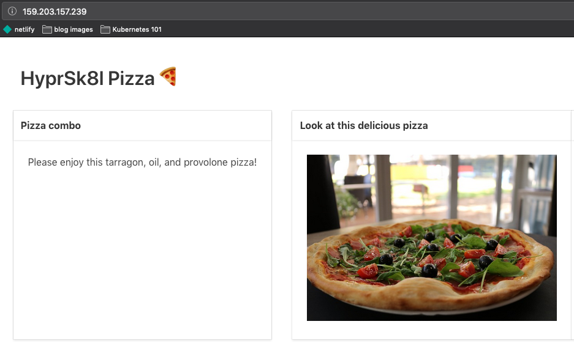
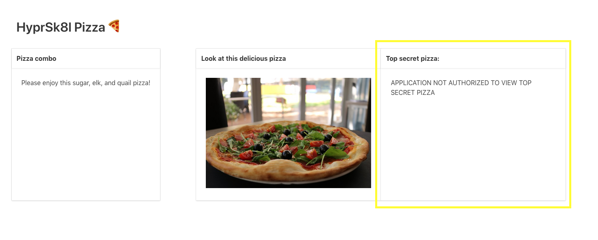
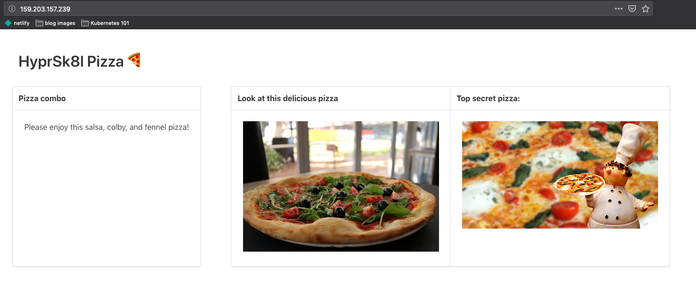

## Setting environment variables in a pod

If you've ever run an application, you've likely used environment variables to configure its behavior. Everything from database connection details to license keys are passed in this way. Now that we know how to launch pods, let's go over how you get environment variables to your running application.

The first key detail is that environment variables are configured on the container level (remember, pods can have multiple containers). This means you'll define them under the `container:` key in your manifest. Let's update the frontend service deployment to include the `SHOW_PIZZA=true` environment variable:

```
apiVersion: apps/v1
kind: Deployment
metadata:
  name: frontend-service-deployment
  labels:
    app: hs-pizza-frontend
    workshop: kubernetes-101
spec:
  replicas: 2
  strategy:
    type: RollingUpdate
  selector:
    matchLabels:
      app: hs-pizza-frontend
      workshop: kubernetes-101
  template:
    metadata:
      labels:
        app: hs-pizza-frontend
        workshop: kubernetes-101
    spec:
      containers:
      - name: hs-pizza-frontend-container
        image: ponderosa/hs-pizza-frontend-service:latest
        imagePullPolicy: Always
        ports:
        - containerPort: 1234
        readinessProbe:
          httpGet:
            path: /health-check
            port: 1234
        env:
          - name: SHOW_PIZZA
            value: "true"
```

As you can see, the `env` section defines the environment for `hs-pizza-frontend-container`. When oru application detects that `SHOW_PIZZA` is present, it will show a photo of some pizza (check out `frontend-service/app.py` for how that's working).

Let's apply this change with `kubectl apply -f k8s/frontend-deployment.yaml`. Once you apply it, open up your application in the browser. You should now see a delicious pizza on the homepage!



## Creating `ConfigMaps` and using them in pods

It's often useful to have different configurations in different contexts. If, for example, we had a staging environment and a production environment, we might want to set `SHOW_PIZZA=true` in one and `SHOW_PIZZA=false` in another. If we hard-code an environment variable in a deployment, as we do above, then we'd need to duplicate the entire deployment in order to change one thing. Fortunately, Kubernetes offers a first-class solution to this problem: the `ConfigMap`. As its name suggests, a `ConfigMap` contains configuration which you can access like a map (aka a hash, aka a dictionary). 

Let's start by creating a `ConfigMap` manifest:

```
apiVersion: v1
kind: ConfigMap
metadata:
  name: frontend-configmap
data:
  SHOW_PIZZA: "true"
```

Save this to `k8s/frontend-configmap.yaml` and then apply it to the cluster with `kubectl apply -f k8s/frontend-configmap.yaml`.

If you run `kubectl describe configmap frontend-configmap`, you should see what we just created!

```
$ kubectl describe configmap frontend-configmap
Name:         frontend-configmap
Namespace:    default
Labels:       <none>
Annotations:  kubectl.kubernetes.io/last-applied-configuration:
                {"apiVersion":"v1","data":{"SHOW_PIZZA":"true"},"kind":"ConfigMap","metadata":{"annotations":{},"name":"frontend-configmap","namespace":"d...

Data
====
SHOW_PIZZA:
----
true
Events:  <none>
```

Now that we have our config stored in the cluster, we can update our deployment to source an environment variable from it:

```
apiVersion: apps/v1
kind: Deployment
metadata:
  name: frontend-service-deployment
  labels:
    app: hs-pizza-frontend
    workshop: kubernetes-101
spec:
  replicas: 2
  strategy:
    type: RollingUpdate
  selector:
    matchLabels:
      app: hs-pizza-frontend
      workshop: kubernetes-101
  template:
    metadata:
      labels:
        app: hs-pizza-frontend
        workshop: kubernetes-101
    spec:
      containers:
      - name: hs-pizza-frontend-container
        image: ponderosa/hs-pizza-frontend-service:latest
        imagePullPolicy: Always
        ports:
        - containerPort: 1234
        readinessProbe:
          httpGet:
            path: /health-check
            port: 1234
        env:
          - name: SHOW_PIZZA
            valueFrom:
              configMapKeyRef:
                name: frontend-configmap
                key: SHOW_PIZZA
```

The only change here is that instead of hard-coding `value: "True"`, we're instead saying to get the `valueFrom` the `SHOW_PIZZA` key in the configmap named `frontend-configmap`. 

Let's apply the changes with `kubectl apply -f k8s/frontend-service-deployment.yaml`. Once your new pods are running, visit the homepage — the pizza should still be visible. If you describe the newly created pod with `kubectl describe pod <pod-id-here>`, you can see that the environment variable is now sourced from the configmap:

```
$ kubectl describe pod frontend-service-deployment-56fd465875-kth5n | grep -A 1 Environment
    Environment:
      SHOW_PIZZA:  <set to the key 'SHOW_PIZZA' of config map 'frontend-configmap'>  Optional: false
```

## Creating and using secrets

> Note: this section explains the Kubernetes `secret` primitive but should not be considered a primer on secure practices in Kubernetes clusters. To make instruction clearer, this section indeed does some things that are very obviously insecure (e.g. displaying "secret" content to any viewer of a website).

Although Kubernetes has [role-based access control](https://kubernetes.io/docs/reference/access-authn-authz/rbac/) which might be combined with `ConfigMaps` to regulate access to sensitive values in the cluster, there are many security considerations for sensitive values which `ConfigMaps` are not designed to handle. The good news is that there is something called a Kubernetes `secret` which works almost exactly like a `ConfigMap`, but which is designed to be more secure. The under-the-hood details of Kubernetes secrets are beyond the scope of this workshop but the Kubernetes [docs](https://kubernetes.io/docs/concepts/configuration/secret/) and [secrets design doc](https://github.com/kubernetes/community/blob/master/contributors/design-proposals/auth/secrets.md) are good reading, and there are a variety of more targeted resources on Kubernetes security out there.

OK, so if you're an astute pizza fan, you'll notice that there is some locked content on the homepage of HyprSk8l Pizza's website:



This is happening because the `frontend-service` application expects a `SECRET_PIZZA_PASSWORD` environment variable to be set to `PIZZARULES`:

```python
SECRET_PIZZA_PASSWORD = "pizzarules"

...

def pizza_password_correct():
    return os.environ.get("SECRET_PIZZA_PASSWORD", "") == SECRET_PIZZA_PASSWORD
```

To get the application to show the pizza, we _could_ hard-code this environment variable in the deployment or add it to the `ConfigMap`. However, since this is the `secrets` section, we're going to create a Kubernetes `secret` to hold this information. A secret manifest looks like this:

```
apiVersion: v1
kind: Secret
metadata:
  name: frontend
type: Opaque
data:
  SECRET_PIZZA_PASSWORD: cGl6emFydWxlcw==
```

You'll notice that the `SECRET_PIZZA_PASSWORD` isn't "pizzarules" in this manifest. That's because secret values are Base64 encoded by default, so they can store more than Just Strings. To get the base64-encoded value in our secret manifest, we just ran 

```bash
echo -n pizzarules | base64
cGl6emFydWxlcw==
```

If you save the manifest to `k8s/frontend-secret.yaml`, you can apply it with `kubectl apply -f k8s/frontend-secret.yaml`. Then, you can inspect it in the cluster with `kubectl describe secret frontend`:

```
Name:         frontend
Namespace:    default
Labels:       <none>
Annotations:
Type:         Opaque

Data
====
SECRET_PIZZA_PASSWORD:  10 bytes
```

If you'd like to see the secret's contents, you'll need to run `kubectl edit secret frontend`, which should open it up in vim (or whatever your editor is configured as).

Now that we've created our secret, let's add a `SECRET_PIZZA_PASSWORD` environment variable to the container in our frontend deployment:

```
kind: Deployment
metadata:
  name: frontend-service-deployment
  labels:
    app: hs-pizza-frontend
    workshop: kubernetes-101
spec:
  replicas: 2
  strategy:
    type: RollingUpdate
  selector:
    matchLabels:
      app: hs-pizza-frontend
      workshop: kubernetes-101
  template:
    metadata:
      labels:
        app: hs-pizza-frontend
        workshop: kubernetes-101
    spec:
      containers:
      - name: hs-pizza-frontend-container
        image: ponderosa/hs-pizza-frontend-service:latest
        imagePullPolicy: Always
        ports:
        - containerPort: 1234
        readinessProbe:
          httpGet:
            path: /health-check
            port: 1234
        env:
          - name: SHOW_PIZZA
            valueFrom:
              configMapKeyRef:
                name: frontend-configmap
                key: SHOW_PIZZA
          - name: SECRET_PIZZA_PASSWORD
            valueFrom:
              secretKeyRef:
                name: frontend 
                key: SECRET_PIZZA_PASSWORD
```

Just like sourcing the `SHOW_PIZZA` environment variable's value from `configMapKeyRef`, we can source the `SECRET_PIZZA_PASSWORD` environment variable value the `frontend` secret. If we check out the homepage in our browser, the secret pizza has been revealed!



## Exercise: adding a `ConfigMap` and environment variable to the topping-suggestion application container

Now you know how to set environment variables and create configMaps. The topping suggestion service 