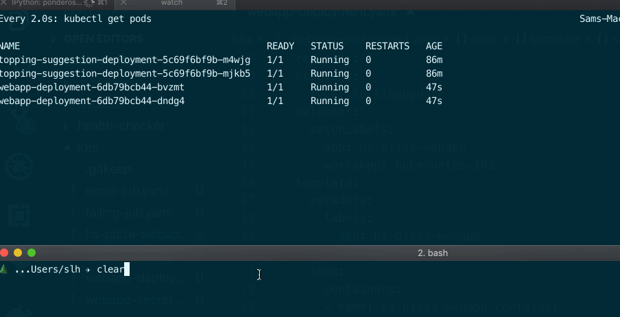
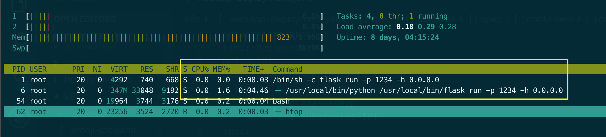
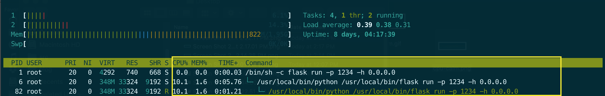

Even after moving the application to Kubernetes, HyperScale Pizza is still seeing sporadic performance issues. Some investigation reveals that these issues are correlated with the `/extremely-expensive-operation` endpoint in the webapp. It turns out that when this endpoint is hit, the pod running the application starts hogging RAM to the point that other requests are slowed down. Everyone in the office is stunned that it was that endpoint...

### Limiting resource usage

When run on a traditional server, applications are bound by the resource limitations of their host — they can only use as much CPU and RAM as is available on the box — and Kubernetes pods have the same constraints. The difference, however, is that Kubernetes is designed to run multiple pods on the same host. All of a sudden, the pod can't expect to use all of the host's resources, since other pods may also need those resources.

For this reason, it is extremely advisable to set resource requests and resource limits for both memory and CPU when creating pod specifications. Resource requests and resource limits are set on the container level (not the pod level).

#### Resource requests vs resource limits

Resource _requests_ are used to place a pod on a node that has adequate resources to run it. When you tell Kubernetes to run a pod that needs X amount of CPU and X amount of memory, Kubernetes finds a node that has adequate available resources to run it on, then places it there (see more details [here](https://kubernetes.io/docs/concepts/configuration/manage-compute-resources-container/#how-pods-with-resource-requests-are-scheduled)).

Resource _limits_ are used to cut a pod off when it starts hogging resources. In the case when CPU exceeds the specified limit, CPU access is simply throttled (which slows down whatever operation is happening). When memory use exceeds the specified limit, the pod is eligible to be restarted.

When you're just getting started with an application, it can be easier to set resource requests and resource limits to the same value.

### Setting memory requests and limits

With this knowledge about resource requests and limits in hand, let's take a look at the `/extremely-expensive-operation` endpoint. What's it doing that uses so much memory? Checking it out in the browser starts to give a clue:


It looks like the team shipped a killer feature where we raise 2 to an arbitrary power...that can use quite a lot of RAM! The code raises 2 to the power of whatever's set in `?pizza_exponent=`:

```
@app.route("/extremely-expensive-operation")
def extremely_expensive_operation():
    exponent = int(request.args.get("pizza_exponent")) or 0
    return f"2 raised to the power of {exponent} gives you ... {2**exponent} pizzas. That's a lot of pizza."
``` 

The application has to hold an extremely large number in working memory, which can cause a real problem. Checking out the logs, we can see that some power users are throwing some extremely large numbers at the application...

```
[17/May/2019 14:02:22] "GET /extremely-expensive-operation?pizza_exponent=3 HTTP/1.1" 200 -
[17/May/2019 14:02:25] "GET /extremely-expensive-operation?pizza_exponent=8000000000 HTTP/1.1" 200 -
[17/May/2019 14:02:25] "GET /extremely-expensive-operation?pizza_exponent=4000000000 HTTP/1.1" 200 -
```

This explains a lot! Our application is raising two to the eight billionth power — that uses a lot of memory! Let's set a RAM resource limit on our application so that this type of request doesn't affect other pods running on the node. To do this, we'll update `k8s/webapp-deployment.yaml` to include a memory request and memory limit of `0.25Gi`:

```
apiVersion: apps/v1
kind: Deployment
metadata:
  name: webapp-deployment
  labels:
    app: hs-pizza-webapp
    workshop: kubernetes-101
spec:
  replicas: 2
  strategy:
    type: RollingUpdate
  selector:
    matchLabels:
      app: hs-pizza-webapp
      workshop: kubernetes-101
  template:
    metadata:
      labels:
        app: hs-pizza-webapp
        workshop: kubernetes-101
    spec:
      containers:
      - name: hs-pizza-webapp-container
        image: ponderosa/hs-pizza-webapp:latest
        imagePullPolicy: Always
        ports:
        - containerPort: 1234
        readinessProbe:
          httpGet:
            path: /health-check
            port: 1234
        env:
          - name: SHOW_PIZZA
            valueFrom:
              configMapKeyRef:
                name: webapp-configmap
                key: SHOW_PIZZA
          - name: SECRET_PIZZA_PASSWORD
            valueFrom:
              secretKeyRef:
                name: webapp 
                key: SECRET_PIZZA_PASSWORD
        resources:
          requests:
            memory: "0.25Gi"
          limits:
            memory: "0.25Gi"
        command: ["/bin/sh", "-c", "flask run -p 1234 -h 0.0.0.0"]
```

Let's apply it to the cluster with `kubectl apply -f k8s/webapp-deployment.yaml`. If you don't already have a webapp service running, you can start directing traffic to these pods with `kubectl apply -f resources/webapp-service.yaml`.

Now, if we try to hit `/extremely-expensive-operation` with a large value, we can see Kubernetes cutting off from using more resources and then restarting it. In the below recording, we have one terminal window running `watch kubectl get pods`, which gives us the status of our cluster's pods every 2 seconds. In the other window, we run a `curl` command that hits the extremely expensive operation endpoint.



If you run `kubectl describe` against the restarted pod, you can see that the pod was restarted because it ran out of memory:

```
$ kubectl describe po webapp-deployment-6db79bcb44-bvzmt

...

Containers:
  hs-pizza-webapp-container:
    ...
    Last State:     Terminated
      Reason:       OOMKilled
      Exit Code:    137
      Started:      Fri, 14 Jun 2019 13:31:54 -0400
      Finished:     Fri, 14 Jun 2019 13:32:45 -0400

```

See [Wikipedia](https://en.wikipedia.org/wiki/Out_of_memory) for more info on the OOM killer.

### Setting CPU requests and limits

Just like container specification should set a limit to how much RAM they need, they should also specify how much CPU they need. There's more detail on the units used to specify CPU requests/limits [here](https://kubernetes.io/docs/concepts/configuration/manage-compute-resources-container/#meaning-of-cpu), but it's also a good idea to familiarize yourself with what a CPU really [does](https://en.wikipedia.org/wiki/Central_processing_unit). 

A CPU request of 1 indicates that we want our container to be able to monopolize an entire CPU on a node, while a CPU request of 0.25 indicates that we only need a quarter of a CPU at any given time. Let's try setting an extremely very modest CPU value for our webapp:

```
apiVersion: apps/v1
kind: Deployment
metadata:
  name: webapp-deployment
  labels:
    app: hs-pizza-webapp
    workshop: kubernetes-101
spec:
  replicas: 1
  strategy:
    type: RollingUpdate
  selector:
    matchLabels:
      app: hs-pizza-webapp
      workshop: kubernetes-101
  template:
    metadata:
      labels:
        app: hs-pizza-webapp
        workshop: kubernetes-101
    spec:
      containers:
      - name: hs-pizza-webapp-container
        image: ponderosa/hs-pizza-webapp:latest
        imagePullPolicy: Always
        ports:
        - containerPort: 1234
        readinessProbe:
          httpGet:
            path: /health-check
            port: 1234
        env:
          - name: SHOW_PIZZA
            valueFrom:
              configMapKeyRef:
                name: webapp-configmap
                key: SHOW_PIZZA
          - name: SECRET_PIZZA_PASSWORD
            valueFrom:
              secretKeyRef:
                name: webapp 
                key: SECRET_PIZZA_PASSWORD
        resources:
          requests:
            memory: "0.25Gi"
            cpu: 0.1
          limits:
            memory: "0.25Gi"
            cpu: 0.1
        command: ["/bin/sh", "-c", "flask run -p 1234 -h 0.0.0.0"]
```

This will prevent our webapp container from hogging too much CPU on the server when performing the answering queries made of the `extremely-expensive-operation` endpoint. Once you've run `kubectl apply -f k8s/webapp-deployment.yaml`, go ahead and shell into the running webapp container with `kubectl exec -it <the-pod-name> bash` (we have reduced replicas to 1 so that we know exactly which pod will field the request to our service). Then run `htop`, which is a program which shows you how many resources are being consumed by each process in your container. You should see something pretty calm-looking, like this:




Now, keeping HTOP up, go ahead and run `curl http://<your-service-ip>/extremely-expensive-operation?pizza_exponent=1000000`. In addition to being memory-intensive, this operation is also very CPU intensive (that's a lot of multiplication of very big numbers!). If you look at your `htop` screen now, you can see that CPU use is 10.1%, which means it's hitting our configured ceiling (10.1% of ):



## Exercise: raising CPU requests and limits

Now that you've seen CPU hit a 10% ceiling, try allocating more CPU to the webapp container and watching CPU use change when you hit the `extremely-expensive-operation` endpoint.

## Exercise: adding CPU and memory requests and limits to topping suggestion deployment

Just like our webapp deployment should specify memory requests and limits, our topping suggestion deployment needs the same thing. Add memory requests and limits to that deployment and make sure that our app is still operational!